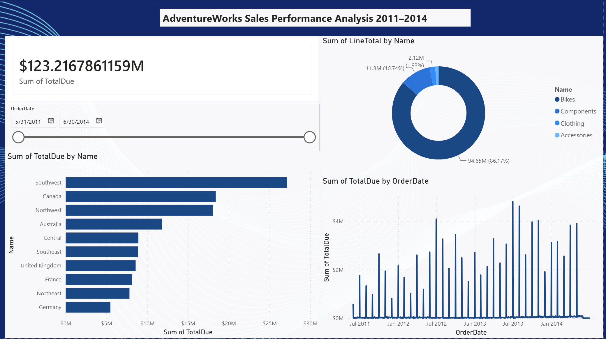
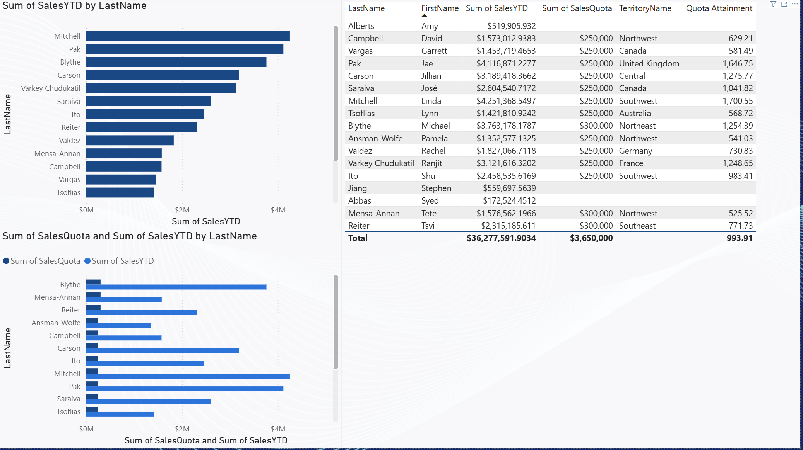
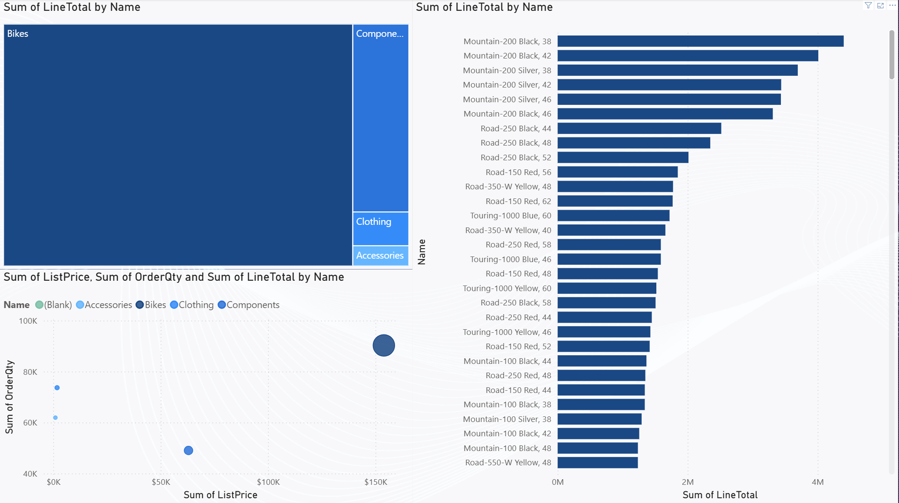

# AdventureWorks Sales Performance Analysis

## Project Overview
Analysis of Microsoft AdventureWorks 2022 sales data (2011–2014) to identify revenue trends, top-performing territories, product profitability, and sales representative performance versus quota.

## Dashboard Preview

### Page 1 — Sales Overview

### Page 2 — Sales Rep Performance

### Page 3 — Product Analysis

## Business Questions Answered
1. Which territories drive the most revenue?
2. Which product categories generate the most profit?
3. How do sales representatives perform relative to their quotas?
4. What is the revenue trend from 2011 to 2014?
5. What is the relationship between product price and units sold?

## Key Findings
- **Southwest territory** leads all regions with over $25M in revenue
- **Bikes category** dominates with 86.17% of total product revenue ($94.65M)
- **Mitchell** is the top sales rep with $4.25M in sales — 1,700% above quota
- Revenue peaked in **2013 at ~$48M** before declining in 2014
- High-priced products ($100K+) such as Touring-1000 series sell in low volumes but generate significant revenue

## Recommendations
- Investigate the revenue decline in 2014 — identify whether it is seasonal or structural
- Review quota-setting process: most reps exceed quota by 500–1,700%, suggesting quotas may be set too low
- Consider expanding Bikes inventory in Southwest and Canada territories, which show the strongest demand
- Evaluate pricing strategy for Components and Accessories, which together account for less than 14% of revenue

## Tools Used
| Tool | Purpose |
|------|---------|
| SQL Server 2022 (Express) | Data storage and querying |
| SSMS | Writing and running SQL queries |
| Power BI Desktop | Interactive dashboard (3 pages) |
| GitHub | Version control and portfolio |

## SQL Queries
Key queries included in `SQLQuery1.sql`:
- Revenue trend by year and quarter
- Top products by revenue (4-table JOIN)
- Sales rep performance vs quota using `RANK()` window function
- Territory comparison by revenue and order volume
- Top 10 customers by lifetime value

## Dataset
Microsoft AdventureWorks 2022 sample database
- Source: [github.com/Microsoft/sql-server-samples](https://github.com/Microsoft/sql-server-samples/releases/tag/adventureworks)
- Records: ~31,000 sales orders (2011–2014)
- Schema used: Sales, Production, HumanResources, Person

## How to Run
1. Download `AdventureWorks2022.bak` from the link above
2. Restore into SQL Server using SSMS
3. Run `SQLQuery1.sql` in SSMS to explore the data
4. Open `adventureworks_dashboard.pbix` in Power BI Desktop
5. Update the data source connection to `localhost\SQLEXPRESS`
